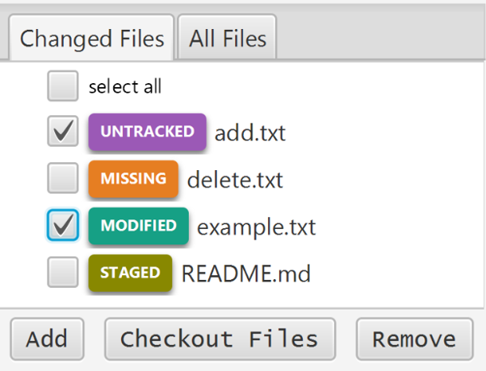

.. _add:

====================
Adding Files
====================

In order to commit, you need to have changes saved in the *index*. These changes are saved in a file-by-file basis. When you have created a new file or files or made changes to an existing file or files, the files will show up here:

Select the checkbox of all the files you want to add, then press 'add' to add them to the *index*. Once the changes are saved in the index, you can *commit* the changes to save the versions of files that are in the index.
