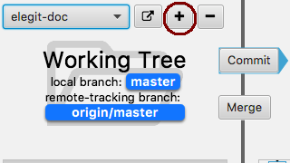

.. _contribute-docs:

======================
Help Add Documentation
======================

Elegit is an educational tool. If there is something unclear that you would like to explain better, create documentation for it!

The documentation for Elegit is written in `reStructuredText <http://thomas-cokelaer.info/tutorials/sphinx/rest_syntax.html>`_ and generated using `Sphinx <http://www.sphinx-doc.org/en/1.5.1/>`_. You can add documentation files to our `documentation repository <https://github.com/TheElegitTeam/elegit-doc>`_. See below for more details on writing docs.

Installing Sphinx
----------------------
To parse the files written in reStructuredText into the actual HTML docs, we use a tool called Sphinx. To view your new pages or changes, you will first need to `install Sphinx <http://www.sphinx-doc.org/en/1.5.1/tutorial.html>`_ on your machine. The easiest way to install it is with ``pip install sphinx``.

Adding Files
------------
Existing and new pages should all be in the ``docs/`` directory. Before creating a new file, check to see if there is a relevant page that it would make more sense to add to. If you do create a new file, make sure you add it to the table of contents in ``index.rst`` or Sphinx will give you the warning::

    $ WARNING: document isn't included in any toctree

Simply open or create the ``.rst`` file you wish to edit and write away!

Creating HTML
-------------
Generating documentation from the ``.rst`` files is very easy. Simply run ``make html`` from the ``docs/`` directory and Sphinx will create the corresponding HTML. The results can be found in ``_build/html``. If something seems off or you don't see a change that you just made, running ``make clean`` before you build can sometimes help.

Inserting Images
----------------
Images are essential to any good tutorial. To insert an image, use the image directive. Details can be found by looking at the `documentation <http://docutils.sourceforge.net/docs/ref/rst/directives.html#image>`_ or by looking at the source of :ref:`intro-tutorial` or this page. If possible, take large screenshots by using a display with a high resolution and scale to 50%. This makes it look much better:

**Screenshot from regular display:**

**Screenshot from retina display:**

.. image:: _static/screenshots/add_button_retina.png
    :scale: 50%
    :alt: The "add" button

Next Steps
----------
Now let's get started! First look at the documentation that currently exists and read :ref:`notes`. Here are some tasks to get started on (and feel free to add more):

* Complete :ref:`intro-tutorial` tutorial
* Create page on distinctions between Working Tree, Local Repository, and Remote Repository
* Change the :ref:`add` page to be more general and talk about staging
* Write tutorial on branching (something like `this <https://git-scm.com/book/en/v2/Git-Branching-Basic-Branching-and-Merging>`_ or `this tutorial <https://www.atlassian.com/git/tutorials/using-branches>`_ but in Elegit)
* Page on merge window and its options
* Write detailed tutorial(s) on merging
* Even more on merging?
* Page on what the :ref:`tree-view` represents
* Page on what the files view represents
* Page on the commit info window (that pops up when you click on a commit)
* Create pages for other missing basics
