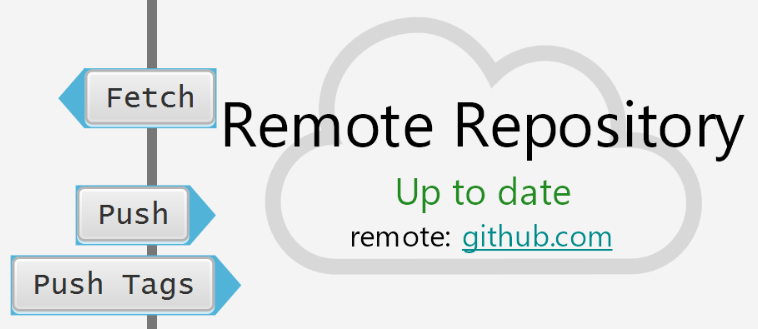

========
Fetching
========

What does Fetch do? Great question.

Fetch will gather all the commits in the remote that you don't have and copy them to your repository. Note: this will copy commits that are referenced by untracked branches. Once you have fetched changes from the remote repository, you can merge them to propagate those changes to your working direcotry.

To fetch, make sure you have the remote set up and press fetch:

Once the fetch has completed, click *merge* to include changes made in your current branch that were only in the remote repositoy into your current copy of the repository.