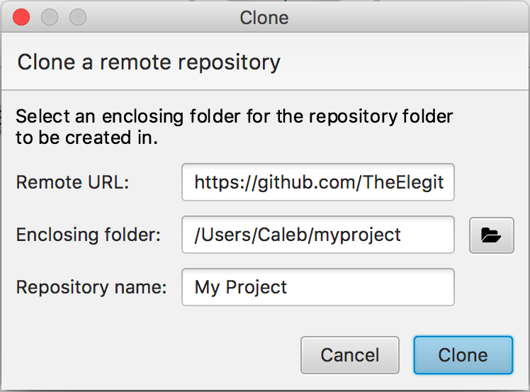

.. _intro-tutorial:

====================
First Elegit Project
====================

Loading a Repository
-----------------------
In order to use Elegit you will first need to:

* `Install Git <https://git-scm.com/book/en/v2/Getting-Started-Installing-Git>`_
* Have an existing git repository, either locally or remotely
* Create an account with GitHub, Bitbucket, or another similar service

Next click the plus button in the top left corner:

.. image:: _static/screenshots/new_repo.png
     :scale: 50%

If you already have a local copy of the git repository you want to work with, select **Load existing repository** and open the folder containing the repository. Otherwise, click **Clone repository** (or navigate **Repository > Clone**).

Fill out the information for your project and click **Clone**. If the repository has loaded successfully, you should see a :ref:`tree structure <tree-view>` in the middle of the screen representing the project status and history. To learn more about how Elegit shows the state of your repository, see :ref:`repo-status`.

Adding Changes
--------------
As you work on your project, you will notice that Elegit will display the files you have changed in the file view on the left. Initially, they will be tagged as `MODIFIED`. When wish to add a file, simply click the check next to it and press the "Add" button. You should now see the tag changed to `STAGED`. By staging a file you are saying you are finalizing the modifications to that file and are ready to commit it.

Committing Changes
------------------
The commit box shows which files you have staged. Add a useful message and hit the "Commit" button. Congrats!

Pushing Changes
---------------
:ref:`push`
