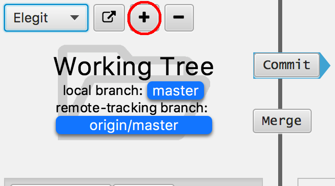

.. _intro-tutorial:

====================
First Elegit Project
====================

Create a New Repository
-----------------------
In order to use Elegit you will first need to:

* Make sure git is installed on your machine
* Have an existing git repository
* Create an account with GitHub, Bitbucket, or another similar service

Next click the plus button in the top left corner:

If you do not already have a local copy of the repository you want to work with, click "Clone repository", otherwise click "Load existing repository".

Once you have loaded a repository, you should see a :ref:`tree structure <tree-view>` in the middle of the screen representing the project status and history.

Adding Changes
--------------
As you work on your project, you will notice that Elegit will display the files you have changed in the file view on the left. Initially, they will be tagged as `MODIFIED`. When wish to add a file, simply click the check next to it and press the "Add" button. You should now see the tag changed to `STAGED`. By staging a file you are saying you are finalizing the modifications to that file and are ready to commit it.

Committing Changes
------------------
The commit box shows which files you have staged. Add a useful message and hit the "Commit" button. Congrats!

Pushing Changes
---------------
:ref:`push`
